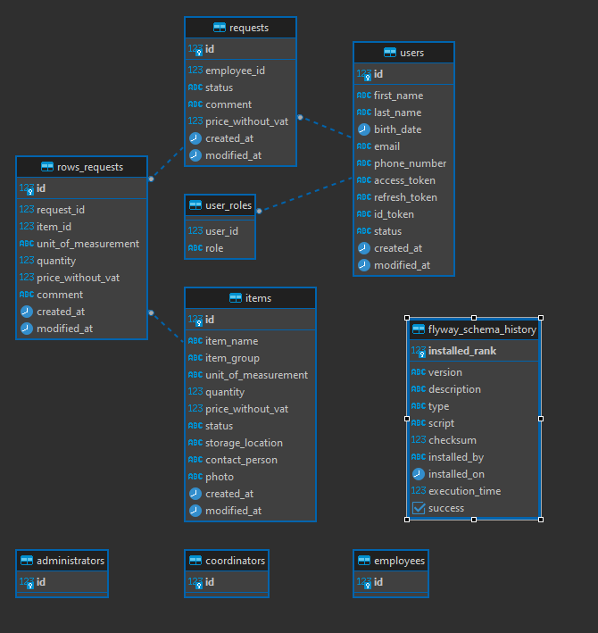

# Technologies
· Java

• Spring Boot

• Spring Security

• OAUTH2

• Spring Data JPA

• Hibernate ORM

• Flyway

• PostgreSQL

• Spring MVC

• Lombok

• InteliiJ IDEA

• Dbeaver

• Swagger

# Features

### User Authentication and Management:
User registration and management are core features, with distinct roles for employees, coordinators, and administrators, indicating a role-based access control system.
OAuth2 integration with Google suggests a secure and convenient sign-in method for users.
### Item Management:
The system allows for the creation, updating, and deletion of items, which are probably the goods stored in the warehouse.
Items can be viewed collectively or individually, suggesting a well-organized inventory system.
### Request Handling:
Employees can create and manage requests, possibly for stock retrieval or supply needs.
Coordinators have the ability to manage and respond to these requests, possibly indicating a tiered structure where coordinators oversee and fulfill employee requests.
### Row Management:
Both employees and coordinators can manage “rows”, which might refer to rows of inventory or storage locations within the warehouse.
There are functionalities to retrieve, update, and delete row information, which is essential for accurate inventory placement and tracking.
### Role Management:
Administrators can assign roles, allowing for dynamic access control depending on the changing responsibilities of the staff.

# Endpoints
Common Row Controller: Manages general row operations.

GET /common/row/{rowRequestId}: Retrieves a row by its ID.
Coordinator Item Controller: Handles item management by coordinators.

PUT /coordinator/items/update/{itemId}: Updates an existing item.
POST /coordinator/items: Creates a new item.
GET /coordinator/items/all: Lists all items.
DELETE /coordinator/items/delete/{itemId}: Deletes an existing item.
Employee Request Controller: Manages request operations by employees.

PUT /employee/requests/{requestId}: Updates an existing request.
POST /employee/requests: Submits a new request.
POST /employee/requests/{requestId}/items: Adds an item to an existing request.
Coordinator Rows Controller: Manages row operations by coordinators.

GET /coordinator/rows/request/{requestId}: Shows all rows by request ID.
GET /coordinator/rows/filtered: Retrieves filtered row data.
Common Request Controller: Manages common request operations.

GET /common/request/{requestId}: Fetches a request by its ID.
Employee Row Controller: Manages rows by employees.

GET /employee/rows/{rowRequestId}: Retrieves a specific row by ID.
PATCH /employee/rows/{rowRequestId}: Updates an existing row.
DELETE /employee/rows/{requestId}/{rowRequestId}: Removes an item from a request.
Authentication Controller: Offers authentication functionalities.

POST /register/employee: Registers an employee.
POST /register/coordinator: Registers a coordinator.
POST /register/administrator: Registers an administrator.
GET /revoke: Logs out from OAuth2 Google.
GET /my-data: Retrieves current user information.
GET /login/oauth2/code/google: Handles OAuth2 Google login.
DELETE /user/delete/{id}: Deletes a user by ID.
Administrator Controller: Provides functionalities for administrators.

POST /administrator/{userId}/roles: Assigns roles to a user.
Coordinator Request Controller: Manages requests by coordinators.

PATCH /coordinator/requests/{requestId}/status: Changes the status of a request.
GET /coordinator/requests/all: Shows all requests.

# Database
### Database schema: 

# Database scripts

### Database manage scripts location path:

### src/main/resources/db/migration

# Summary

The application is in an operational state, providing a suite of functionalities to manage items, requests, and user roles. It is structured to cater to different user types, including employees, coordinators, and administrators, each with tailored access and control permissions.
Role of administrator is also a topic for discussion for example how to administrator

### Areas for Improvement:

Authority and Role Management:

The current system for changing user roles, specifically transitioning between employee and coordinator roles, requires further optimization. The process is not as seamless as it could be, which may lead to inconsistencies or a lack of immediate updates in the user's authority level.

Validation Mechanism

More  validation would be advisable.

User Interface :

Implementation the user interface requires some time, unfortunately mine has been limited in recent days but it is possible for me :)

Credential Storage

The practice of storing credentials within the application repository is a security risk.

# Installation and Startup Guide

Prerequisites

• Java Development Kit (JDK) 11 or later installed

• PostgreSQL Database Server 

• Gradle or Maven (depending on the project's build system).

Step 1: Clone the Repository

Step 2: Configure Database

Step 3: Set Environment Variables at yml file

Step 4: Update Application Properties

Step 5: Build the Application

Step 6: Run the Application

